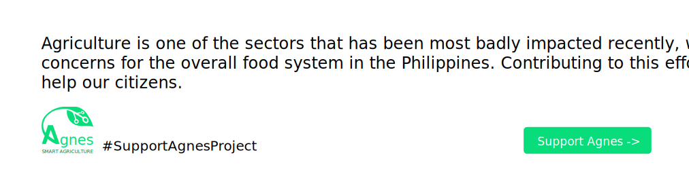

## Introduction
Agnes API is the core backend service of the Agnes farm management platform, a comprehensive agricultural management system that includes a web application, command-line interface, and workflow orchestration powered by n8n. Built with FastAPI and Python 3.11+, this high-performance REST API provides comprehensive IoT device management, sensor data collection, and real-time monitoring capabilities for agricultural operations. It manages all nodes in the farm including devices, sensors, locations, categories, and readings, enabling farmers to optimize productivity through efficient data exchange and centralized farm operations management. The platform features robust user authentication and authorization mechanisms, location-based farm organization, and flexible category management for devices and data. Built on a solid foundation of PostgreSQL database with Alembic migrations, the API ensures data integrity and scalability while serving as the data backbone for the entire Agnes ecosystem. Comprehensive testing with pytest guarantees reliability and maintainability of the codebase throughout development and production deployments.

## Installation
1. Install all the required packages
```bash
pip install -r requirements.txt
```
2. Copy the .env.example to .env

3. Configure the migration
```bash
spartan migrate init
```

4. Create all the tables
```bash
spartan migrate upgrade
```

5. Insert dummy data
```bash
spartan db seed
```

6. Then run it using the following command
```bash
spartan serve
```

## Usage
1. To install
```bash
pip install python-spartan
```

2. Try
```bash
spartan --help
```

## Testing
```bash
pytest
```

## Changelog

Please see [CHANGELOG](CHANGELOG.md) for more information on what has changed recently.

## Contributing

Please see [CONTRIBUTING](CONTRIBUTING.md) for details.

## Security Vulnerabilities

Please review [our security policy](../../security/policy) on how to report security vulnerabilities.

## Credits

- [Sydel Palinlin](https://github.com/nerdmonkey)
- [All Contributors](../../contributors)

## License

The MIT License (MIT). Please see [License File](LICENSE.md) for more information.
